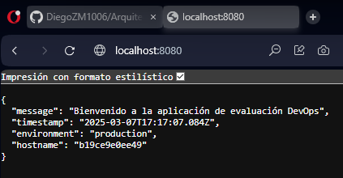
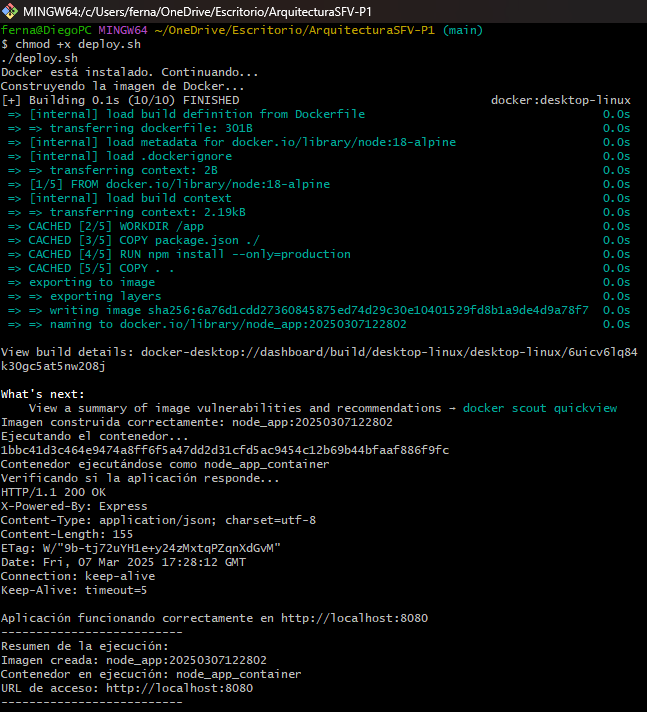
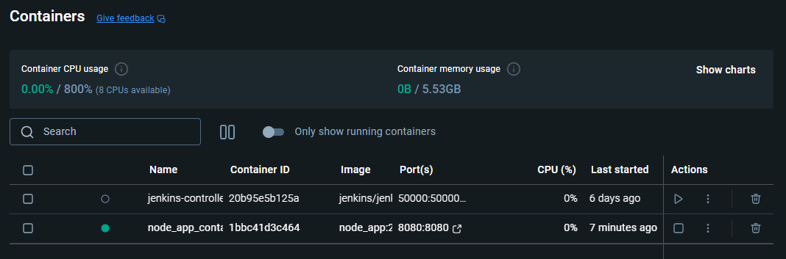
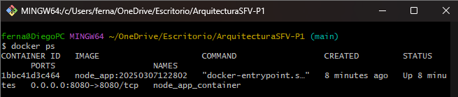

# ArquitecturaSFV-P1

# Evaluación Práctica - Ingeniería de Software V

## Información del Estudiante
- **Nombre:** Diego Fernando Mueses Zuñiga
- **Código:** A00382021
- **Fecha:** 07/03/2025

## Resumen de la Solución
Esta solución contiene la contenerización de una aplicación Node.js utilizando Docker, un script de automatización en Bash para simplificar la ejecución del contenedor y documentación detallada sobre su uso.

## Dockerfile
[Explica las decisiones tomadas en la creación del Dockerfile]

Las decisiones que tome fueron las siguientes:

El Dockerfile sigue buenas prácticas:
- Usamos la imagen `node:18-alpine` para optimización.
- Establecemos `/app` como directorio de trabajo.
- Copiamos y solo instalamos las dependencias necesarias (`--only=production`).
- Exponemos el puerto 8080 y configuramos las variables de entorno.
- Utilizamos `CMD ["node", "app.js"]` para ejecutar la aplicación.

Para ver que nuestro docker file funciona corremos los siguientes comandos:

- docker build -t node_app .
- docker images (La imagen tendria que estar creada)
- docker run -d --name node_app_container -p 8080:8080 -e PORT=8080 -e NODE_ENV=production node_app
- docker ps (Tendriamos que estar viendo el contenedor ejecutandose)
- Podemos ingresar a http://localhost:8080



## Script de Automatización

Mi script realiza las siguientes tareas:

1. Verifica si Docker está instalado.
2. Construye la imagen con un tag basado en la fecha y hora.
3. Ejecuta un contenedor con las variables de entorno necesarias.
4. Realiza una prueba con `curl` para verificar que el servicio responde.
5. Muestra un resumen del estado de la ejecución.

Para correr este script en bash debemos ejecutar el siguiente comando:

- chmod +x deploy.sh ./deploy.sh




## Principios DevOps Aplicados

1. **Automatización:** Se usa un script para evitar errores manuales.
2. **Contenerización:** Se emplea Docker para asegurar entornos consistentes.
3. **Monitoreo:** La solución emplea verificiaciones con `curl` para comprobar que la aplicacion responde

## Captura de Pantalla
[Incluye al menos una captura de pantalla que muestre tu aplicación funcionando en el contenedor]





## Mejoras Futuras
[Describe al menos 3 mejoras que podrían implementarse en el futuro]

1. Implementar un Docker Compose para manejar múltiples servicios.
2. Incluir logs estructurados para facilitar el monitoreo.
3. Automatizar el despliegue con GitHub Actions o Jenkins.

## Instrucciones para Ejecutar

1. Clonar el repositorio:
   ```sh
   git clone https://github.com/DiegoZM1006/ArquitecturaSFV-P1.git
   cd ArquitecturaSFV-P1
    ```
2. Ejecutar el script en bash: 
    ```sh 
    chmod +x deploy.sh
    ./deploy.sh
    ```
3. Acceder a la aplicacion de Node.js: http://localhost:8080
